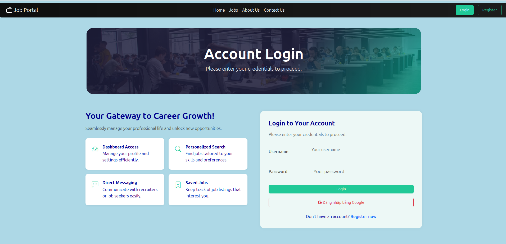
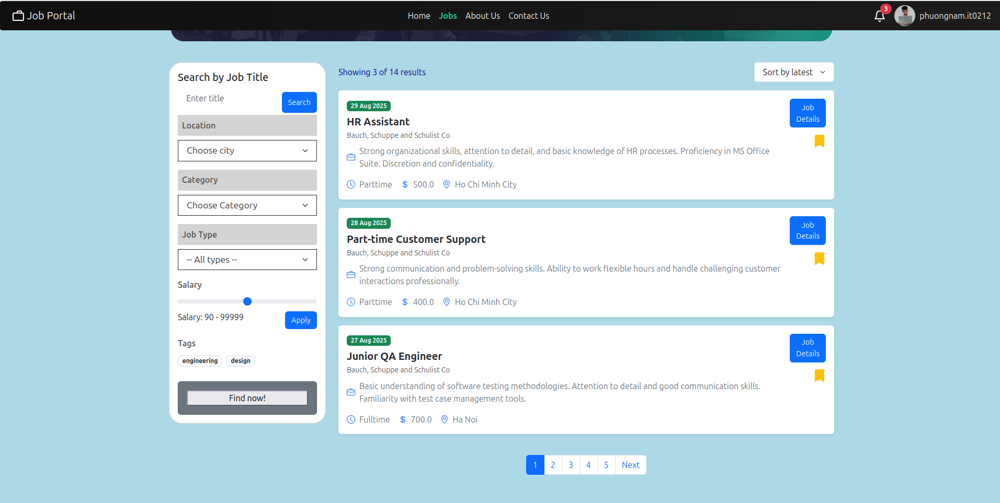
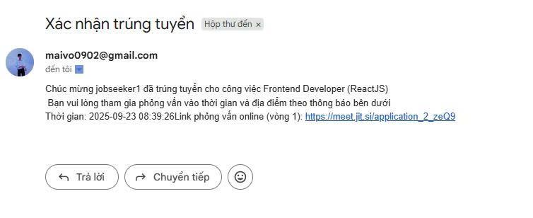

# Job Portal System

## Overview
Hệ thống cổng thông tin việc làm là một nền tảng trực tuyến giúp kết nối giữa người tìm việc và nhà tuyển dụng một cách hiệu quả và thuận tiện. Hệ thống cung cấp các chức năng quản lý hồ sơ, đăng tin tuyển dụng, ứng tuyển, quản lý đơn ứng tuyển, chat và phỏng vấn trực tuyến. Người tìm việc có thể tạo hồ sơ cá nhân, tải CV và tìm kiếm việc làm phù hợp theo tiêu chí mong muốn, trong khi nhà tuyển dụng có thể đăng tin tuyển dụng, quản lý đơn ứng tuyển và theo dõi tiến trình tuyển dụng. Dự án hướng tới việc số hóa quy trình tuyển dụng, giúp tiết kiệm thời gian, nâng cao hiệu quả và minh bạch thông tin giữa các bên.  

## Technical
- **Frontend**: HTML/CSS  
- **Backend**: Flask  
- **Cơ sở dữ liệu**: MySQL  
- **Lưu trữ hình ảnh**: Cloudinary  
- **Video call**: Jitsi (WebRTC)  
- **Xác thực**: Flask-login  
- **Login**: Google Login (OAuth 2.0)  
- **Realtime Chat**: Socket.IO  
- **Thống kê**: Chart.js  
- **Thông báo**: Email (SMTP)  

## Features

### Xác thực và phân quyền
- Đăng nhập, đăng ký với vai trò **người tìm việc**, **nhà tuyển dụng**, **quản trị viên**.  
- Nhà tuyển dụng cần được quản trị viên xác thực trước khi đăng tin tuyển dụng.  

### Hồ sơ và CV
- Người tìm việc tạo hồ sơ cá nhân, tải lên CV (định dạng **.doc** hoặc **.pdf**).  
- Người dùng có thể lưu nhiều CV khác nhau để nộp cho các vị trí khác nhau.  

### Tìm kiếm và lọc tin tuyển dụng
- Tìm kiếm việc làm theo **từ khóa**, **vị trí**, **mức lương**, **loại hình công việc**.  
- Sắp xếp kết quả theo **ngày đăng**, **mức lương**, hoặc **độ phổ biến**.  

### Quản lý quy trình ứng tuyển
- Theo dõi trạng thái đơn ứng tuyển:  
  *Đã nộp → Nhà tuyển dụng đã xem → Từ chối → Được mời phỏng vấn → Đang phỏng vấn → Trúng tuyển*  
- Người tìm việc có thể rút hồ sơ trước thời gian kết thúc tin tuyển dụng.  

### Quản lý tin tuyển dụng
- Tin tuyển dụng có trạng thái giúp nhà tuyển dụng theo dõi quá trình tuyển dụng.  

### Quản lý hồ sơ ứng tuyển
- Nhà tuyển dụng xem được hồ sơ ứng tuyển của tin tuyển dụng mình đăng.  
- Không thể xem thông tin profile cá nhân của ứng viên.  

### Chat và phỏng vấn trực tuyến
- Chat thời gian thực (Socket.IO / Firebase).  
- Phỏng vấn online qua **video call (Jitsi WebRTC)**.  

### Thông báo và nhắc nhở
- Thông báo trạng thái hồ sơ hoặc việc làm mới.  
- Nhắc lịch phỏng vấn hoặc hạn ứng tuyển.  
- Thông báo qua hệ thống hoặc qua email (**SMTP / Gmail API**).  

### Thống kê và báo cáo
- Nhà tuyển dụng xem thống kê hồ sơ đã nhận, tỷ lệ ứng viên đạt yêu cầu.  
- Admin xem thống kê toàn hệ thống từ cả **nhà tuyển dụng** và **người tìm việc**.  

## Diagrams

### Kiến trúc hệ thống

### Sơ đồ lớp

## Result

- **Trang chủ**  
    

- **Trang tìm kiếm việc làm**  
    

- **Trang chi tiết việc làm**  
    

- **Trang liên hệ**  
    

- **Đăng nhập bằng Username/Password**  
    

- **Đăng ký tài khoản**  
    

- **Đăng nhập bằng Google**  
    

- **Quản lý tài khoản (Admin)**  
    

- **Tạo & quản lý hồ sơ CV trực tuyến**  
    

- **Tìm kiếm & lọc tin tuyển dụng**  
    

- **Nộp hồ sơ trực tuyến**  
    

- **Đăng tin tuyển dụng mới**  
    

- **Quản lý hồ sơ ứng tuyển**  
    

- **Xem chi tiết đơn ứng tuyển**  
    

- **Tạo lịch phỏng vấn**  
    

- **Thông tin lịch phỏng vấn**  
    

- **Hệ thống gửi mail cho người dùng**  
    

- **Thông báo tự động**  
    

- **Nhắn tin giữa nhà tuyển dụng và ứng viên**  
    

- **Trang thống kê báo cáo của nhà tuyển dụng**  
    
